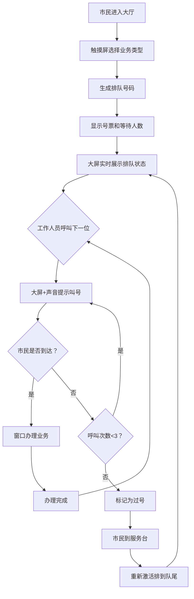

## 1. 产品概述

政务服务大厅取号排队系统，用于在政务服务大厅部署的触摸屏和大屏幕上，实现市民取号、排队展示、窗口呼叫和过号处理的全流程数字化管理。目标是提升政务大厅运行效率，改善市民办事体验，减少人工干预。

## 2. 核心功能

### 2.1 用户角色

| 角色 | 使用场景 | 核心功能 |
|------|----------|----------|
| 办事市民 | 触摸屏取号、大厅看大屏排队 | 选择业务类型取号、查看排队状态 |
| 窗口工作人员 | 工位电脑操作 | 呼叫下一位、过号处理、办理完成 |
| 服务台工作人员 | 服务台电脑 | 重新激活过号、查询排队状态 |

### 2.2 功能模块

1. **取号页面（触摸屏）**：业务类型选择、号票打印/展示、等待人数显示
2. **排队展示大屏**：多窗口实时叫号展示、颜色状态区分、滚动更新
3. **窗口呼叫页面**：呼叫下一个、重复呼叫、办理完成、过号标记
4. **过号处理**：三次呼叫无人到标记过号、服务台重新激活排到队尾
5. **实时更新机制**：模拟轮询/WebSocket自动刷新数据

### 2.3 页面详情

| 页面名称 | 模块名称 | 功能描述 |
|----------|----------|----------|
| 取号页 | 业务类型选择区 | 展示社保、税务、工商、房产等业务卡片，点击取号 |
| 取号页 | 号票展示区 | 显示取到的号码、业务类型、当前等待人数、取号时间 |
| 排队大屏 | 窗口叫号展示区 | 分栏展示各窗口当前叫号，大号字体远距离可见 |
| 排队大屏 | 状态颜色标识 | 已叫号（绿色）、正在办理（黄色）、过号（红色） |
| 窗口呼叫页 | 当前号码展示 | 显示当前正在办理的号码和业务类型 |
| 窗口呼叫页 | 操作按钮区 | 呼叫下一个、重复呼叫、办理完成、标记过号 |
| 服务台页 | 过号列表 | 展示所有过号记录，支持重新激活排到队尾 |

## 3. 核心流程

市民进入大厅 → 在触摸屏选择业务类型 → 系统生成号码并显示等待人数 → 排队大屏实时展示各窗口叫号 → 工作人员呼叫下一位 → 大屏和声音提示 → 市民到窗口办理 → 办理完成呼叫下一位。若三次呼叫无人到达则标记过号，市民可到服务台重新激活排到队尾。

## 4. 用户界面设计

### 4.1 设计风格
- **主色调**：政务蓝（#1e40af）作为主色，配合深灰背景
- **状态色**：绿色（#16a34a）= 已叫号/正常、黄色（#ca8a04）= 正在办理、红色（#dc2626）= 过号
- **字体**：超大号无衬线字体，确保远距离清晰可读，标题最小 72px，号码显示 120px+
- **布局**：网格化分栏布局，卡片式设计，超大触摸按钮（≥100px）
- **风格**：简洁大气、高对比度、政府公信力风格，减少装饰元素

### 4.2 页面设计概述

| 页面名称 | 模块名称 | UI 元素 |
|----------|----------|---------|
| 取号页 | 业务选择卡片 | 大图标+大文字，触摸友好，点击反馈动画 |
| 取号页 | 号票展示 | 模拟纸质号票样式，大号号码居中显示，二维码可选 |
| 排队大屏 | 窗口栏 | 左右分栏或多列网格，窗口号+号码+状态色块，滚动动画 |
| 排队大屏 | 顶部公告栏 | 日期时间、大厅名称、欢迎语 |
| 窗口呼叫页 | 操作面板 | 大号按钮，当前号码醒目展示，呼叫计数 |
| 服务台页 | 过号列表 | 表格展示过号记录，操作按钮 |

### 4.3 响应性
- 桌面优先设计，针对大尺寸屏幕（55寸+）优化
- 触摸屏页面：大按钮、大间距、防误触
- 支持全屏显示模式
- 最低适配 1920×1080 分辨率

### 4.4 动画与交互
- 叫号时号码闪烁+放大动画
- 状态切换颜色过渡动画
- 大屏数据更新时平滑滚动
- 按钮按下/释放状态反馈
- 声音提示配合叫号动画
