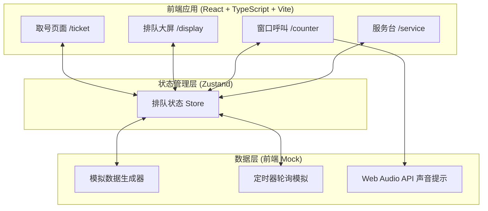
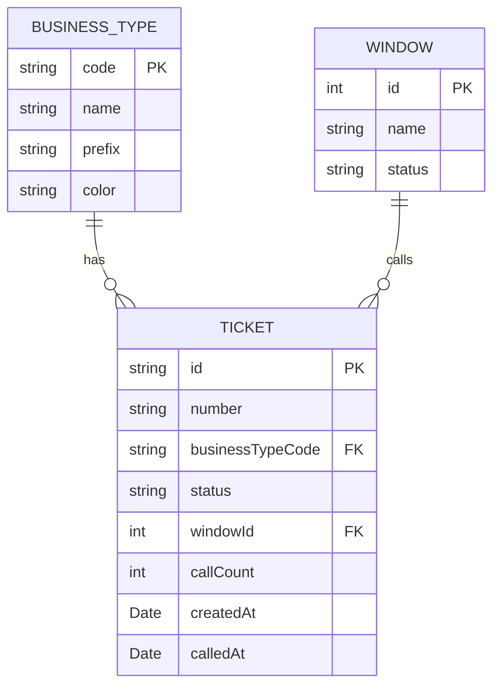

## 1. 架构设计



## 2. 技术描述

- **前端**：React@18 + TypeScript + Vite
- **样式**：Tailwind CSS 3
- **状态管理**：Zustand（跨页面共享排队状态）
- **路由**：React Router DOM
- **图标**：Lucide React
- **数据**：前端 Mock 数据 + setInterval 模拟轮询更新
- **声音**：Web Audio API / SpeechSynthesis 语音播报
- **后端**：无（纯前端原型）

## 3. 路由定义

| 路由 | 用途 |
|------|------|
| / | 首页导航（可跳转到各功能页） |
| /ticket | 取号页面（触摸屏） |
| /display | 排队展示大屏 |
| /counter/:id | 窗口呼叫页面 |
| /service | 服务台过号处理页面 |

## 4. 数据模型

### 4.1 数据模型定义



### 4.2 TypeScript 类型定义

```typescript
// 业务类型
interface BusinessType {
  code: string;
  name: string;
  prefix: string;
  color: string;
  icon: string;
}

// 号码状态
type TicketStatus = 'waiting' | 'called' | 'serving' | 'passed' | 'completed';

// 排队号码
interface Ticket {
  id: string;
  number: string;
  businessTypeCode: string;
  status: TicketStatus;
  windowId?: number;
  callCount: number;
  createdAt: Date;
  calledAt?: Date;
}

// 窗口
interface Window {
  id: number;
  name: string;
  status: 'idle' | 'busy';
  currentTicket?: Ticket;
}

// 排队系统状态
interface QueueState {
  tickets: Ticket[];
  windows: Window[];
  businessTypes: BusinessType[];
  // 操作方法
  takeTicket: (businessTypeCode: string) => Ticket;
  callNext: (windowId: number) => Ticket | null;
  recall: (windowId: number) => void;
  markPassed: (windowId: number) => void;
  completeService: (windowId: number) => void;
  reactivateTicket: (ticketId: string) => void;
  getWaitingCount: (businessTypeCode?: string) => number;
}
```
